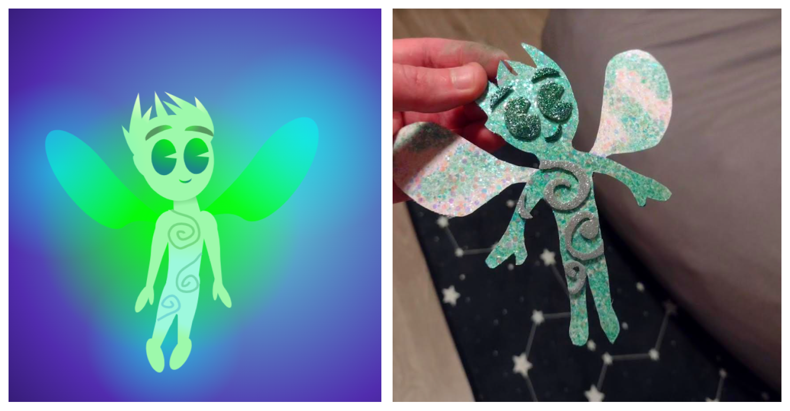

# magic_fight

### wat?

Very simple text loop game. Cast a spell!

For the love of gods, make sure it's Python 3+ (preferably 3.10+). Then:

`pip install -r requirements.txt`

`python magic_fight.py`

I originally wanted to make it jUsT wOrK with no dependencies whatsoever (and
made a dumb workaround for the upsidedown library for that very reason), but the allure
of mypy was far too strong.

So, sorry. There's a requirements file of the perfectly primitive sort. 🤪

### Recommendation

`alias myblackisort='black .; isort .; mypy .;'`


### How to Submit a Character

To create a new character, you must create a new subdirectory within the `characters/`
directory with the name of your choice. During gameplay, the character's name will
be nicely title-cased and formatted. For example:

`vasily` becomes `Vasily`

`mary_anne` becomes `Mary Anne`

Next, you must add the two required files within your new character directory:

1. `bio.txt` - A short description of the character. I don't throw it to OpenAI or anything
yet, so don't get too excited. It's just to show a nice prompt when someone chooses a character
at the beginning.
2. `magic.json` - A JSON file containing your character's spell information. It should
be structured like:

```
{
    "deals": {
        "dark": {
            "amount": <integer>,
            "spells": <array_of_creative_and/or_descriptive_strings>
        },
        "light": {
            "amount": <integer>,
            "spells": <array_of_creative_and/or_descriptive_strings>
        },
        "chaotic": {
            "amount": <integer>,
            "spells": <array_of_creative_and/or_descriptive_strings>
        },
        "ordered": {
            "amount": <integer>,
            "spells": <array_of_creative_and/or_descriptive_strings>
        },
        "hot": {
            "amount": <integer>,
            "spells": <array_of_creative_and/or_descriptive_strings>
        },
        "cold": {
            "amount": <integer>,
            "spells": <array_of_creative_and/or_descriptive_strings>
        }
    },
    "takes": {
        "dark": {
            "amount": <integer>
        },
        "light": {
            "amount": <integer>
        },
        "chaotic": {
            "amount": <integer>
        },
        "ordered": {
            "amount": <integer>
        },
        "hot": {
            "amount": <integer>
        },
        "cold": {
            "amount": <integer>
        }
    }
}

```

As you can see, there are two toplevel keys - `deals` and `takes` - representing
the hit amounts and/or actual spell descriptions of magical damage respectively
dealt by your character on their turn, or maximally taken by your character when hit by
the opponent. For both `deals` and `takes`, the sum of the `amount` across the 6 types of
magic (dark, light, chaotic, ordered, hot, and cold) must be 10 (i.e., damage dealt
must add up to 10, and damage taken must likewise add up to 10).


For each magic type under `deals`, an array of strings of any size (the bigger the better, within
reason) is used to generate spell choices on your character's turn. The phrasing
should be a present-tense thing like "Shoot fireballs!" (a fair example for the `hot` list)
or "Leach every particle of hope and joy from their mind" (probably `dark`). One spell
from each type list will be randomly chosen and displayed as a choice upon your character's
turn. Likewise, the computer will randomly choose one spell from any one of the dimensions
when your character is the opponent.

It is okay for your character to deal or take zero damage in a category, as long as
everything still adds up to 10. In the former case, the list of spell choices should
be empty.


#### Optional character files

You can create a character directory containing only `bio.txt` and `magic.json`, and
the game should work. But it's more fun when you also add (in the same directory,
at the same, flat level of the bio and magic):

1. `taunts.json` - A JSON file containing things your character might say to the opponent
on their turn. It should be structured like:

```
{
    "chance": <float_between_0_and_1>,
    "taunts": <array_of_strings>
}
```

If `chance` is 0.95, for example, your character will say something aloud on their turn
95% of the time, chosen randomly from the array of `taunts`. You can look to
[Adrian](https://github.com/fialovy/magic_fight/blob/master/characters/adrian/taunts.json)
or
[Nora](https://github.com/fialovy/magic_fight/blob/master/characters/nora/taunts.json)
for examples and make these as mean or as nice as you like.

2. `reactions.json` - A JSON file containing things your character might say when the
opponent hits them. It should be structured like:

```
{
    "chance": <float_between_0_and_1>,
    "reactions": <array_of_strings>
}
```
You can again look to [Adrian's file](https://github.com/fialovy/magic_fight/blob/master/characters/adrian/reactions.json) for examples of these.

3. `ascii_art.txt` - A text file that ideally contains an ASCII art image depicting
your character and/or the general spirit of them. You could also just throw down
some emoji or something since making good ASCII art is a giant pain (even with help
from websites like [this](https://manytools.org/hacker-tools/convert-images-to-ascii-art/).
If provided, it will be displayed at the beginning of the game when you are choosing
a character to play and/or the opponent. Not required, just fun.

4. `special.json` - A JSON file outlining your character's special abilities, which
will be offered as additional spell choices if present (and
properly implemented in the current dumping ground that is `special_abilities.py` 🤪).
It should be structured like:

```
{
    <ability_name_to_be_displayed_as_spell_choice>: {
        "description": <string>,
        "effect": <name_of_function_you_implement_in_special_abilities.py>
    },
    <another_ability_name_to_be_displayed_as_spell_choice>: {
        "description": <string>,
        "effect": <name_of_another_function_you_implement_in_special_abilities.py>
    },
    ...
}
```
You can implement as many special abilities as you like, as long as each one's
`effect` is the exact match of a function name in [special_abilities.py](https://github.com/fialovy/magic_fight/blob/master/special_abilities.py)
that follows the contract laid out in `SpecialAbility.perform` (take player character, opponent
character, and whatever kwargs you want as arguments; return tuple of player character
and opponent character with whatever changes applied. Eh; just look at the file for examples.)

You can get pretty wild with this if you want to; Nora has a pretty good example of
shapeshifting abilities that implement entirely new characters with their own directories
living within hers.


### Why on earth did you read this far?!

If you did, you may be entitled to a custom-made 🌿 ✨ MEADOW SPRITE FORM ✨ 🌿  refrigerator magnet
featuring the shapeshifter character from this extremely popular hit game! 😱 🧚 😱 🧚 😱

Just pay me as much money as my actual coding job does, for as long as it takes me to
make another one.



