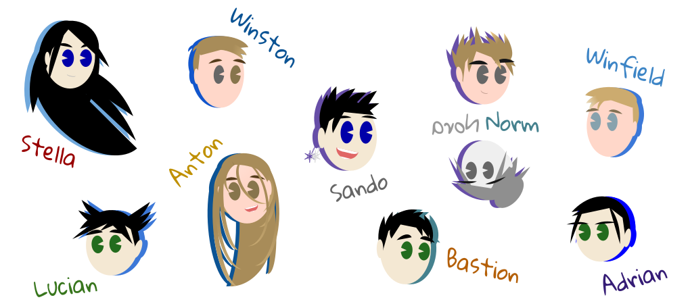

# magic_fight

### wat?

Very simple text loop game. Cast a spell!

For the love of gods, make sure it's Python 3+ (preferably 3.10+). Then:

`pip install -r requirements.txt`

`python magic_fight.py`

I originally wanted to make it jUsT wOrK with no dependencies whatsoever (and
made a dumb workaround for the upsidedown library for that very reason), but the allure
of mypy was far too strong.

So, sorry. There's a requirements file of the perfectly primitive sort. 🤪

### Recommendation

`alias myblackisort='black .; isort .; mypy .;'`

### How to Submit a Character

To create a new character, you must create a new subdirectory within the `characters/`
directory with the name of your choice. During gameplay, the character's name will
be nicely title-cased and formatted. For example:

`vasily` becomes `Vasily`

`mary_anne` becomes `Mary Anne`

Next, you must add the two required files within your new character directory:

1. `bio.txt` - A short description of the character. I don't throw it to OpenAI or anything
yet, so don't get too excited. It's just to show a nice prompt when someone chooses a character
at the beginning.
2. `magic.json` - A JSON file containing your character's spell information. It should
be structured like:

```
{
    "deals": {
        "dark": {
            "amount": <integer>,
            "spells": <array_of_creative_and/or_descriptive_strings>
        },
        "light": {
            "amount": <integer>,
            "spells": <array_of_creative_and/or_descriptive_strings>
        },
        "chaotic": {
            "amount": <integer>,
            "spells": <array_of_creative_and/or_descriptive_strings>
        },
        "ordered": {
            "amount": <integer>,
            "spells": <array_of_creative_and/or_descriptive_strings>
        },
        "hot": {
            "amount": <integer>,
            "spells": <array_of_creative_and/or_descriptive_strings>
        },
        "cold": {
            "amount": <integer>,
            "spells": <array_of_creative_and/or_descriptive_strings>
        }
    },
    "takes": {
        "dark": {
            "amount": <integer>
        },
        "light": {
            "amount": <integer>
        },
        "chaotic": {
            "amount": <integer>
        },
        "ordered": {
            "amount": <integer>
        },
        "hot": {
            "amount": <integer>
        },
        "cold": {
            "amount": <integer>
        }
    }
}

```

As you can see, there are two toplevel keys - `deals` and `takes` - representing
the numerical hit amounts and/or actual spell descriptions of magical damage respectively
dealt by your character on their turn, or maximally taken by your character when hit by
the opponent. For both `deals` and `takes`, the sum of the `amount` across the 6 types of
magic (dark, light, chaotic, ordered, hot, and cold) must be 10 (i.e., damage dealt
must add up to 10, and damage taken likewise must add up to 10).


For each magic type under `deals`, an array of strings of any size (the bigger the better, within
reason) is used to generate spell choices on your character's turn. The phrasing
should be a present-tense thing like "Shoot fireballs!" (a fair example for the `hot` list)
or "Leach every particle of hope and joy from their mind" (probably `dark`). One spell
from each type list will be randomly chosen and displayed as a choice upon your character's
turn. Likewise, the computer will randomly choose one spell from any one of the dimensions
when your character is the opponent.



